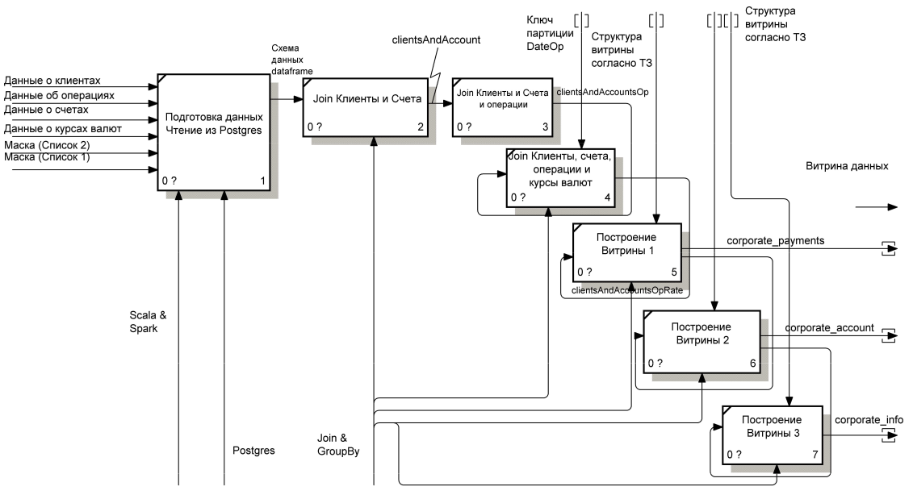

# Клиенты и счета

## Описание проекта

Есть данные о банковских проводках, которые представлены в виде четырех таблиц. Формат хранения данных - CSV. Таблицы имеют следующую структуру:

### 1. Таблица клиентов

|Поле| Описание
|-------- | ----------|
| ClientId| Id клиента|
| ClientName | Наименование клиента |
| Type | Тип клиента (ФЛ. ЮЛ) |
| Form | Организационно-правовая форма|
| RegisterDate | Дата регистрации клиента

### 2. Таблица счетов   

|Поле| Описание
|-------- | ----------|
| AccountId| Id счета (pk) |
| AccountNum | Номер счета |
| ClientId | Id клиента владельца счета (fk) |
| DateOpen | Дата открытия счета

### 3. Таблица операций по счетам

|Поле| Описание
|-------- | ----------|
| AccountDB| Счет дебета проводки (fk)|
| AccountCR | Счет кредита проводки (fk) |
| DateOp | Дата операции|
| Amount | Сумма операции|
| Currency | Валюта операции
| Comment | Назначение платежа


### 4. Таблица курсов валют по отношению к рублю

|Поле| Описание
|-------- | ----------|
| Currency | Валюта |
| Rate | Курс |
| RateDate | Дата курса |

### Список 1

>%а/м%, %а\м%, %автомобиль %, %автомобили %, %транспорт%, %трансп%средс%, %легков%, %тягач%, %вин%, %vin%,%viн:%, %fоrd%, %форд%,%кiа%, %кия%, %киа%%мiтsuвisнi%, %мицубиси%, %нissан%, %ниссан%, %sсанiа%, %вмw%, %бмв%, %аudi%, %ауди%, %jеер%, %джип%, %vоlvо%, %вольво%, %тоyота%, %тойота%, %тоиота%, %нyuнdаi%, %хендай%, %rенаulт%, %рено%, %реugеот%, %пежо%, %lаdа%, %лада%, %dатsuн%, %додж%, %меrсеdеs%, %мерседес%, %vоlкswаgен%, %фольксваген%, %sкоdа%, %шкода%, %самосвал%, %rover%, %ровер%

### Список 2

>%сою%, %соя%, %зерно%, %кукуруз%, %масло%, %молок%, %молоч%, %мясн%, %мясо%, %овощ%, %подсолн%, %пшениц%, %рис%, %с/х%прод%, %с/х%товар%, %с\х%прод%, %с\х%товар%, %сахар%, %сельск%прод%, %сельск%товар%, %сельхоз%прод%, %сельхоз%товар%, %семен%, %семечк%, %сено%, %соев%, %фрукт%, %яиц%, %ячмен%, %картоф%, %томат%, %говя%, %свин%, %курин%, %куриц%, %рыб%, %алко%, %чаи%, %кофе%, %чипс%, %напит%, %бакале%, %конфет%, %колбас%, %морож%, %с/м%, %с\м%, %консерв%, %пищев%, %питан%, %сыр%, %макарон%, %лосос%, %треск%, %саир%, % филе%, % хек%, %хлеб%, %какао%, %кондитер%, %пиво%, %ликер%

## **Задача:**

### Необходимо сформировать три витрины данных на следующие даты:

**2020-11-01, 2020-11-02, 2020-11-03, 2020-11-04**


### Витрина 1. corporate_payments

Строится по каждому уникальному счету (AccountID) из таблицы Operation на заданную дату операции (CutoffDt). Группируется по счету (AccountID), клиенту (ClientId) и дате операции (CutoffDt). Рассчитывает следующие поля:

|Поле| Описание
|-------- | ----------|
| AccountId| Id счета|
| ClientId| Id клиента|
| PaymentAmt | Сумма операций по счету, где счет клиента указан в дебете проводки |
| EnrollementAmt | Сумма операций по счету, где счет клиента указан в кредите проводки |
| TaxAmt | Сумму операций, где счет клиента указан в дебете, и счет кредита 40702 |
| ClearAmt | Сумма операций, где счет клиента указан в кредите, и счет дебета 40802|
| CarsAmt | Сумма операций, где счет клиента указан в дебете проводки и назначение платежа не содержит слов по маскам Списка 1
| FoodAmt | Сумма операций, где счет клиента указан в кредите проводки и назначение платежа содержит слова по Маскам Списка 2
| FLAmt | Сумма операций с физ. лицами. Счет клиента указан в дебете проводки, а клиент в кредите проводки – ФЛ.
| CuttoffDt | Дата операции


### Витрина 2. corporate_account

Строится по каждому уникальному счету (AccountID) из таблицы Operation на заданную дату операции (CutoffDt). Группируется по счету (AccountID) и клиенту (ClientId). Присоединяет информацию о клиенте и счете из таблиц dfClients и dfAccounts по полю ClientId. Рассчитывает поле TotalAmt как сумму PaymentAmt и EnrollmentAmt. Результаты сортируются по счету (AccountID) и дате операции (CutoffDt).

|Поле| Описание
|-------- | ----------|
| AccountId| Id счета|
| AccountNum| Номер счета|
| DateOpen | Дата открытия счета |
| ClientId | Id клиента |
| ClientName | Наименование клиента |
| TotalAmt | Общая сумма оборотов по счету. Считается как сумма PaymentAmt и EnrollementAmt|
| CuttoffDt | Дата операции

### Витрина 3. corporate_info

Строится по каждому уникальному клиенту (ClientId) из таблицы Operation на заданную дату операции (CutoffDt). Присоединяет информацию о клиенте и счетах из таблиц dfClients и dfAccounts по полю ClientId. Рассчитывает общую сумму операций по всем счетам клиента на заданную дату (TotalAmt), которая считается как сумма TotalAmt из витрины corporate_account для всех счетов клиента. В результате получается таблица с информацией о клиентах, их счетах и сумме операций по счетам на заданную дату.

|Поле| Описание
|-------- | ----------|
| ClientId | Id клиента |
| ClientName | Наименование клиента |
| CuttoffDt | Дата операции
| Type | Тип клиента (ФЛ. ЮЛ) |
| Form | Организационно-правовая форма|
| RegisterDate | Дата регистрации клиента
| TotalAmt | Сумма операций по всем счетам клиент. Считается как сумма corporate_account.total_amt по всем счетам.|

## Используемые технологии с обоснованием

Данный проект был выполнен локально, со следующим системным окружением:

**Spark:** 3.3.1  
**Scala:** 2.12.15  
**Средство разработки** jupyter notebook

Так как в данном проекте не требуется потоковая обработка данных, и данные представлены в виде статических таблиц, которые не пополняются, было решено выполнить обработку локально. Обработка данных была выполнена по схеме: загрузил -> произвел преобразования -> выгрузил.

В качестве технологического стека были выбраны Apache Spark и Scala. Spark является основным инструментом распределенной обработки данных, а также технологическим решением для преобразования данных в различных задачах в области Data Engineering. Кроме того, Spark поддерживает различные форматы данных.

## Схема/архитектура
Архитектура решения достаточно проста: исходные файлы формата CSV копируются в локальную папку. Затем, Spark выполняет необходимые трансформации и сохраняет файлы в формате Parquet обратно в ту же локальную папку.


## План реализации

### 1. Подготовка данных

**a) Преобразование входных файлов сsv** 

Для работы с данными был использован формат csv. 

**b) определение схемы данных dataframe**

Для построения dataframe была сформирована схема данных, основываясь на структуре таблиц, указанной в ТЗ.

**c) Чтение/запись набора данных локальной базы данных**  
**d) Объединение таблиц клиентов и счетов**  

Таблицы клиентов и счетов были объединены в dataframe clientsAndAccounts.

**e) Объединение таблиц clientsAndAccounts и операций**  

Таблица операций была объединена с dataframe clientsAndAccounts в clientsAndAccountsOp, содержащую информацию о клиентах, их счетах и операциях.

**f) Объединение таблиц clientsAndAccounts и курсов валют**  

Операции в трех валютах были приведены к рублевым расчетам, используя информацию о курсах валют. Для этого был использован механизм sql-запросов.

Итоговый dataframe clientsAndAccountsOp содержит данные об операциях в рублях.


### 2. Построение витрины данных corporate_payment (1 Витрина)

Витрина представляет собой dataframe, полученный с помощью агрегированных значений, сгруппированных по основным датафреймам. Построение витрин 2 и 3 зависит от наличия витрины #1, так как они используют ее данные в качестве основы для дальнейшей агрегации и группировки.

<details>
  <summary>ER-диаграмма:</summary>


</details>  
  
Из-за большого объема данных, возникла проблема размещения результатов витрин на репозитории GitHub. Однако, технология Spark предложила решение этой проблемы. Для уменьшения объема сохраняемых данных, было принято решение использовать формат parquet вместо csv. Это позволило существенно сократить размер файлов, что позволило сохранять результаты на репозитории.

### 3. Построение витрины данных corporate_account (#2)

Построение витрины 2 осуществлялось объединением(join) Витрины 1 и датафрейма с клиентами и счетами (clientsAndAccounts).

```scala 
val corporateAccount = corporatePayments
    .join(dfClients.join(dfAccounts, Seq("clientId"))
    .select($"AccountNum", $"AccountID", $"DateOpen", $"ClientName"), Seq("AccountID"))
    .withColumn("TotalAmt", round($"PaymentAmt" + $"EnrollmentAmt", 2))
    .select($"AccountID", $"AccountNum", $"DateOpen", $"ClientId", $"ClientName", $"TotalAmt", $"CutoffDt")
    .orderBy($"AccountID", $"CutoffDt")
```

### 4. Построение витрины данных corporate_info (#3)

Для построения витрины 3 было выполнено объединение (join) витрины 2 и датафрейма с информацией о клиентах и счетах (clientsAndAccounts). Результирующий датафрейм витрины 3 был сформирован на основе следующих полей: ClientId, ClientName, Type, Form, RegisterDate, TotalAmt и CutoffDt.


## Результаты

Результаты данной реализации и проектирования пресдтавлены в следующую структуру:

```bash
.
сlients_and_accounts_project/
│
├── data/
│   ├── Account.csv
│   ├── Clients.csv
│   ├── Lists.csv
│   ├── Operation.csv
│   └── Rate.csv
│
├── data_mart/
│   ├── 2020-11-01/
│   │   ├── corporate_account
│   │   ├── corporate_info
│   │   └── corporate_payments
│   ├── 2020-11-02/
│   │   ├── corporate_account
│   │   ├── corporate_info
│   │   └── corporate_payments
│   ├── 2020-11-03/
│   │   ├── corporate_account
│   │   ├── corporate_info
│   │   └── corporate_payments
│   └── 2020-11-04/
│       ├── corporate_account
│       ├── corporate_info
│       └── corporate_payments
│
├── docs/
│   └── presentation.odp
│
├── pictures/
│   ├── flowchart.png
│   ├── diagram.png
│   └── ...
│
├── src/
│   └── main.ipynb
│
└── README.md
```